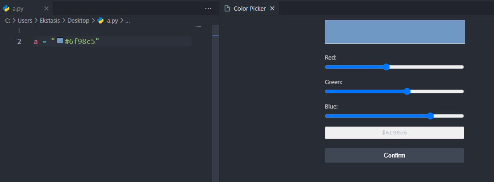

# 🎨 VSCode Color Picker

## Quick Overview

A powerful, intuitive color picker extension for Visual Studio Code that transforms how developers work with color values across multiple file types.



## 🌟 Key Features

- **Interactive Color Selection**: Seamlessly pick and modify colors with an intuitive RGB slider interface
- **Multi-Language Support**: Works across JSON, JavaScript, TypeScript, CSS, and HTML
- **Real-Time Preview**: Instantly see color changes before confirming
- **Keyboard Shortcut**: Quick access with `Ctrl+Alt+C` / `Cmd+Alt+C`

## 🚀 Installation

### From VSCode Marketplace

1. Open Visual Studio Code
2. Go to Extensions (Ctrl+Shift+X)
3. Search for "Color Picker"
4. Click **Install**

### Manual Installation

```bash
ext install color-picker-extension
```

## 💡 Usage

### Selecting a Color

1. Place your cursor on an existing hex color code (e.g., `#FF0000`)
2. Trigger the Color Picker:
   - Press `Ctrl+Alt+C` (Windows/Linux)
   - Press `Cmd+Alt+C` (macOS)
   - Open Command Palette (Ctrl+Shift+P) and type "Pick Color"

### Color Picker Interface

- Adjust colors using intuitive RGB sliders
- See real-time color preview
- Confirm color by clicking "Confirm"

## 🔧 Supported File Types

- JSON
- JavaScript
- TypeScript
- CSS
- HTML

## 🌈 Color Format Support

- 6-digit Hexadecimal Color Codes (e.g., `#FF0000`)

## 🖥️ System Requirements

- Visual Studio Code 1.85.0 or higher
- Windows, macOS, or Linux

## 🐛 Troubleshooting

- Ensure the color code is a standard 6-digit hex format
- Restart VSCode if the extension doesn't appear to work

## 🤝 Contributing

Contributions are welcome!

### How to Contribute

1. Fork the repository
2. Create your feature branch (`git checkout -b feature/AmazingFeature`)
3. Commit your changes (`git commit -m 'Add some AmazingFeature'`)
4. Push to the branch (`git push origin feature/AmazingFeature`)
5. Open a Pull Request

## 📋 Roadmap

- [ ] Support for 8-digit hex colors (with alpha)
- [ ] Additional color format support (RGB, HSL)
- [ ] Custom color palette saving

## 📄 License

Distributed under the MIT License. See `LICENSE` for more information.

## 🏷️ Version History

### [0.1.0] - Initial Release

- Basic color picker functionality
- Support for 6-digit hex colors
- Multi-language file support

## 💌 Feedback

Found a bug? Have a suggestion?

- Open an issue on GitHub
- Email: support@colorpicker.dev

**Happy Coding! 🚀**
